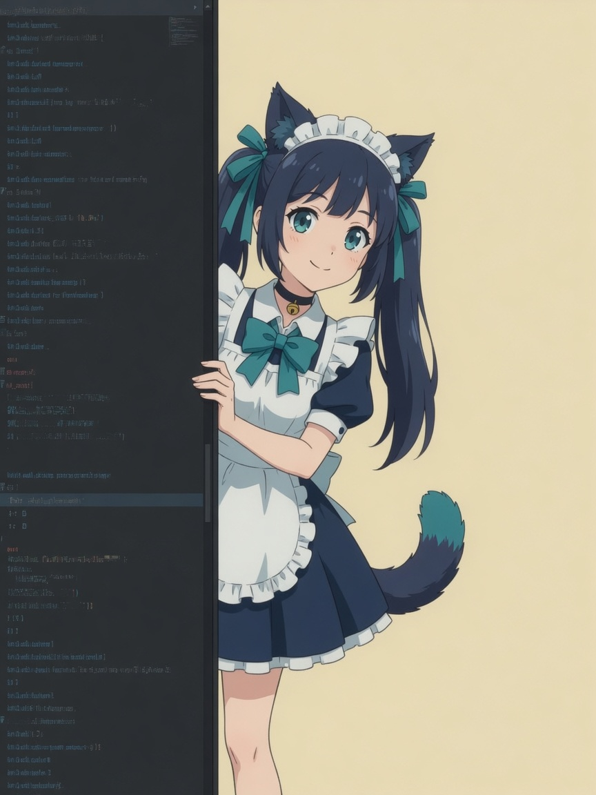

<p align="center">
  
</p>

# OpenLAPP for Copilot

English · [简体中文](./README.zh-CN.md)

Windows x64 VS Code UI extension that registers the local LAPP profile as a Copilot language-model vendor (`openlapp`).

Licensed under [MIT](./LICENSE).

## Install

```bash
pnpm install
pnpm check
pnpm build
pnpm package
```

The VSIX is written under `dist-vsix/`. Install it in VS Code Stable 1.128.1 or later.

## What it does

- Reads the system LAPP profile and system Vault through the vendored `@openlapp/lapp` SDK.
- Registers eligible chat models with hashed public IDs: `openlapp/lapp-<sha256-base64url>`.
- Opens `OpenLAPP: Open Manager` as a full-page editor for providers, Vault metadata, models, defaults, Copilot utility settings, and diagnostics.

On first use the extension asks for informed consent before it watches or creates the shared LAPP folder, or registers models. Other LAPP-compatible apps for the same Windows user can use that location and the same Vault credentials. This is not per-app isolation. Review or withdraw later with `OpenLAPP: Review Shared Profile Consent`.

The extension does not publish, does not use proposed APIs, and does not add a custom chat participant or Activity Bar container.

## Scripts

| Script | Purpose |
| --- | --- |
| `pnpm lint` / `pnpm typecheck` | Static checks |
| `pnpm test:unit` | Eligibility, IDs, tokens, mapping, sanitization, watchers |
| `pnpm test:wire` | OpenAI Chat / Responses / Anthropic mock protocol tests |
| `pnpm test:webview` | Manager workflows and accessibility |
| `pnpm test:integration` | `@vscode/test-electron` host tests |
| `pnpm test:ui-smoke` | `vscode-extension-tester` GUI smoke (fail-closed: launch/test failure exits nonzero) |
| `pnpm package` / `pnpm verify:vsix` | Windows x64 VSIX + content audit |
| `pnpm push` / `pnpm push:all` | Push `HEAD` (and tags) to `origin` |
| `pnpm release:tag` / `pnpm release:push` | Annotated `v<version>` tag; optionally push commit + tag |
| `pnpm release:publish` | Opt-in VS Code Marketplace publish (`gh workflow run`) |

See [docs/RELEASING.md](docs/RELEASING.md) for the GitHub Actions release flow.

## License

[MIT](./LICENSE) © 2026 OpenLAPP
